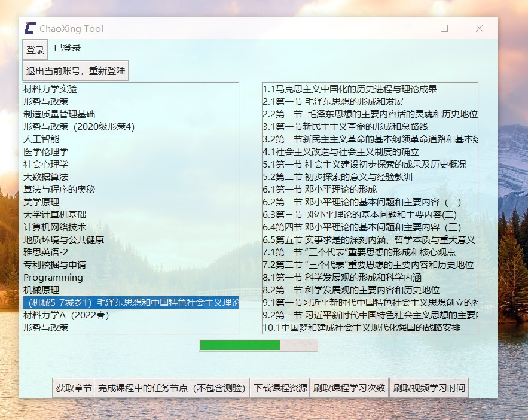

# chaoxing_tool
超星网课助手，用于一键完成超星中的视频任务。基于python语言  
本项目为个人使用过程中基于学习目的开发而来，遵循 [GPL-3.0 License](https://github.com/liuyunfz/chaoxing_tool/blob/master/LICENSE) ，如有疑问请自行阅读相关协议内容。
  
**据网上传闻超星会监测异常，但目前测试过程中尚未发现，请酌情使用**
# 已有功能 
- 登陆超星账号
- 获取章节页数
- 刷取课程学习次数
- 刷取视频学习时间  
- 获取账号中已开启的课程
- 下载课程资源(mp4,pdf,pptx,png等)
- 一键完成所有课程中的任务节点（暂不支持测验）
- 完成单个课程中的所有任务节点（暂不支持测验）
- 多线程功能 (目前仅在任务数>20时自动启用，默认6线程)  
# 如何使用
### 方案一：源代码使用
**前置条件：您必须本地有python环境，建议版本为3.7以上**  
1. 将本仓库内容下载到本地电脑，如果是压缩包请记得先解压。  
2. 在本文件目录中打开命令提示符，输入`pip install -r requirements.txt`来进行第三方模块安装  
3. 在本文件目录中打开命令提示符,输入`python chaoxing.py`进行使用

### 方案二：Release使用
**前置条件：Release中是通过pyinstaller编译的可执行文件，您需要完成[下载](https://github.com/liuyunfz/chaoxing_tool/releases)**  
1. 将下载的文件进行解压  
2. 打开dist目录下的exe可执行文件即可进行使用  

---
**PS**:源代码较Release更新更为频繁，但也较不稳定。release会在添加的几个功能确认稳定后才会正式发布。请根据自己的本地环境与使用需求进行选择下载。 

# 截图

    
# 其他
- 可能遇到的问题：**详见本仓库的 [Disscussion](https://github.com/liuyunfz/chaoxing_tool/discussions/3)**   
- 未来：**详见本仓库的 [Project](https://github.com/liuyunfz/chaoxing_tool/projects)**  
- 本项目长期更新维护，如果您发现用不了或者其他bug欢迎提交issue,在 [discussions](https://github.com/liuyunfz/chaoxing_tool/discussions) 发起讨论或者联系我。  
- 有关超星网络协议的分析过程我也已经放到了我的博客中，欢迎访问 [超星学习通网课分析](https://blog.6yfz.cn/tutorial/python-spider-chaoxing.html)   
