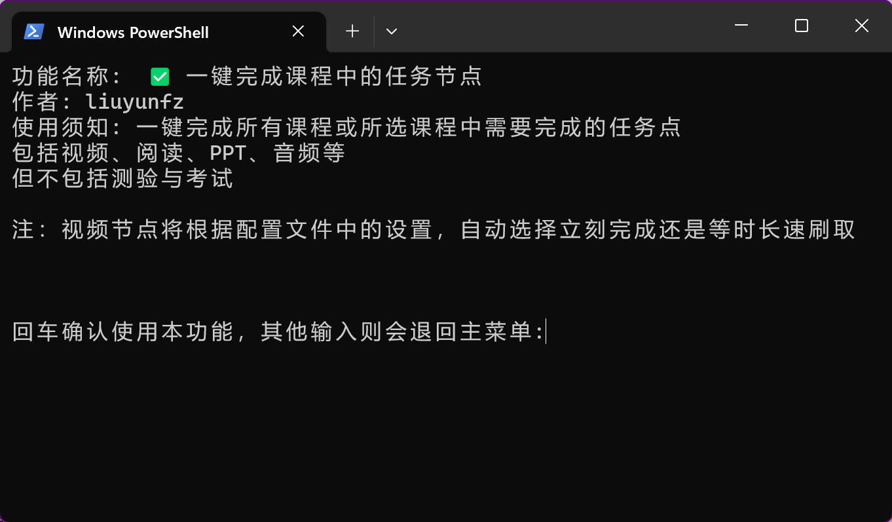
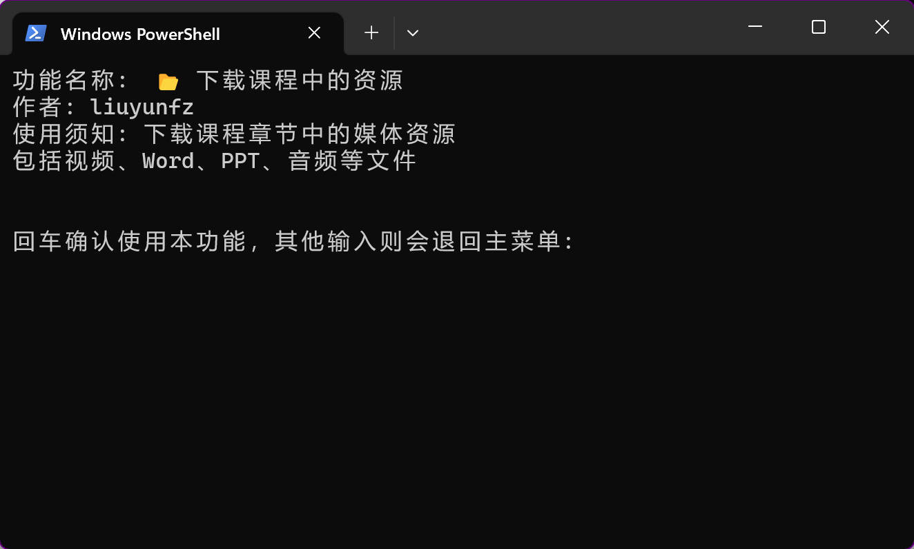
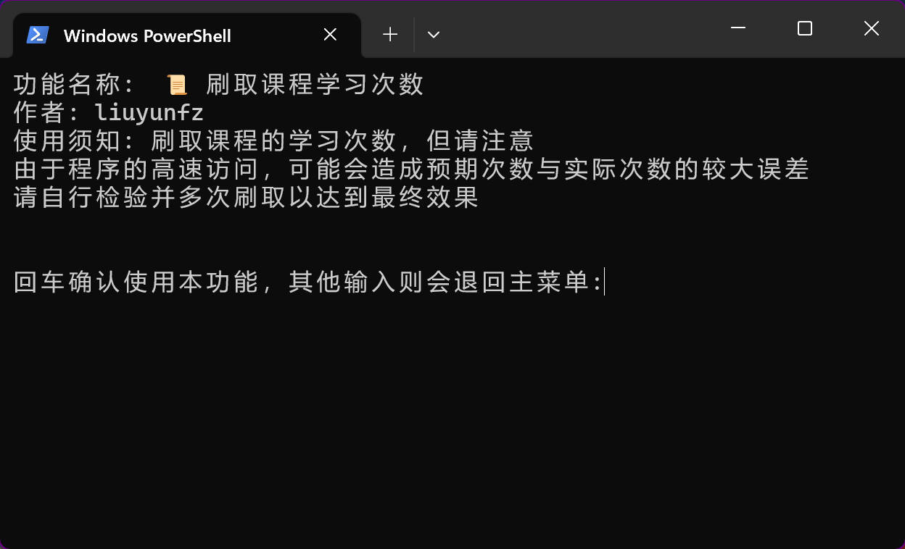
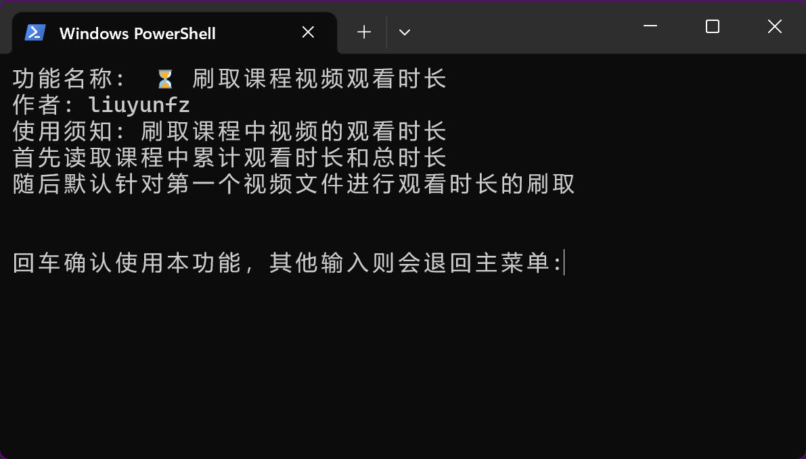

# chaoxing_tool

超星/学习通/尔雅 助手，帮助用户一键完成任务点、下载课程资源等。基于 Python 语言和 requests 包。

本分支是基于原项目的重构，拥有更高的可扩展性和功能的低耦合性，方便更多开发者参与贡献。

项目拥有的Log输出，方便开发者更好的还原用户使用出错时的场景。

## 功能

基础功能如下：

- 用户登录
  - 手机号登录
  - Cookie 登录
- 获取 用户/课程/章节 等数据
- 日志输出
- 程序配置读取与保存

扩展功能如下：

- 一键完成课程中的任务点

  <details>

  

  </details>

- 下载课程中的资源

  <details>

  

  </details>

- 刷取课程学习次数

  <details>

  

  </details>

- 刷取课程视频观看时长

  <details>

  

  </details>

## 运行

以下有两种使用方式，请根据您个人的实际情况与需求选择

### 可执行文件运行

**如果您此前未接触过Python或其他编程语言，且只想直接快捷的使用本工具，请优先选择本方法。**

**但需要注意本方法的文件只能在Windows上运行，不支持Mac**

1. 打开本项目的 [Release](https://github.com/liuyunfz/chaoxing_tool/releases/latest) 页面
2. 下载其中的`chaoxing_tool.zip`压缩包
3. 选择一个储存位置对压缩包进行解压
4. 找到`main.exe`文件双击运行

### 源文件运行

请确保您的电脑拥有`Python3`环境，以及本项目所需要用的package。

首先下载本项目的代码源文件，您可以使用Github自带的Zip download或者使用Git命令`git clone git@github.com:liuyunfz/graph-project.git`

然后对项目需要的第三方包进行安装，您可以直接用pip进行安装`pip install -r requirements.txt`，亦或是使用诸如`virtualenv`的虚拟环境进行安装。

最后通过`python main.py`运行`mian.py`文件即可

### 程序配置

详见项目根目录下的`config.yml`而不是`config.py`

后者是对配置文件进行读取的Python文件，一般不需要进行修改

以下是对`config.yml`文件中一些内容的解释

```yaml
GloConfig:
  timeout: 3  # 全局requests模块的超时时长，即发送http请求后三秒仍未响应则会引起超时报错
  headers:
    User-Agent: 'Mozilla/5.0 (Windows NT 10.0; Win64; x64) AppleWebKit/537.36 (KHTML, like Gecko) Chrome/85.0.4183.102 Safari/537.36 Edg/85.0.564.51' #全局Http请求中协议头的UA设置
  debug:
    enable: True  # 是否开启debug模式，即显示更加详细的软件日志
    level: 8 # Loggru日志输出的等级门槛

FunConfig:
  deal-mission:
    video-mode: 0 # 视频任务点刷取的模式，0为立即完成,1为等时长刷取
  set-log:
    delay: 30 # 刷取学习次数的延迟，单位s

UserData:
  cookie: '' # 里面填写账号Cookie，程序可以自动识别直接登录，免去每次输入账号密码。但Cookie经过一段时间会过期，预计3-30天
  auto-sign: True # 是否开启自动登录，如果为False则即使上述cookie有内容也不会自动登录
```

如果您不太清楚以上的内容，可以不进行任何修改

## 已知问题

详见 [本项目的Bug](https://github.com/liuyunfz/chaoxing_tool/labels/bug)

## Contribute

如果您也想参与到本项目的开发中，包括但不限于新功能的添加、文档的优化。

请阅读本项目的规范文档（还没写），Fork之后提交Pr即可。

## 免责声明

本项目遵循 [GPL-3.0 License](https://github.com/liuyunfz/chaoxing_tool/blob/master/LICENSE) ，仅作为学习途径使用，请勿用于商业用途或破坏他人的知识产权

